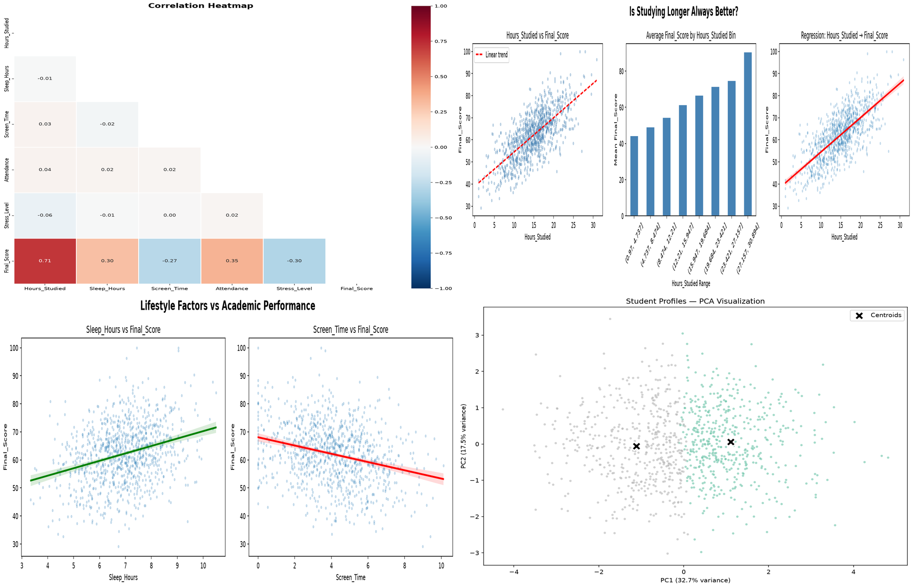

<h1 align="center">🎓 Student Productivity Pattern Analyzer</h1>

<p align="center">
  
  
  
  
</p>

<p align="center">
  End-to-end analysis of <b>1,000 student lifestyle records</b> — from clean synthetic data to correlation, clustering, and SQL-style insights.
</p>

---

## 📊 Dashboard

<p align="center">
  
</p>

The dashboard above visualizes the four core analyses:

| Panel | Insight |
|-------|---------|
| **Correlation Heatmap** | `Hours_Studied` is the strongest driver at **+0.70**; sleep helps, stress and screen time hurt |
| **Study Time vs Score** | Top 10% study ~21.5 h/week vs ~9.5 h for bottom 10% — long hours alone don't win |
| **Lifestyle vs Score** | Sleep and attendance lift performance; screen time and stress drag it down |
| **Student Clusters (PCA)** | Two profiles emerge: a high performer (score 70.7) and a low performer (score 54.9) |

---

## 🗂 Project Structure

```
student-productivity-analyzer/
├── data/
│   └── student_data.csv            # Bundled synthetic dataset (1,000 rows)
├── scripts/
│   ├── 01_data_prep.py             # Verify / prepare the dataset
│   ├── 02_eda.py                   # Distributions, missing values, summary stats
│   ├── 03_correlation.py           # Correlation & non-linear patterns
│   ├── 04_clustering.py            # K-Means student profiling
│   ├── 05_sql_analysis.py          # SQL-style group comparisons
│   └── generate_data.py            # Recreate the synthetic dataset
├── outputs/                        # Generated plots + cluster summary CSV
│   ├── dashboard.png               # README showcase dashboard (2×2 grid)
│   ├── 02_distributions.png
│   ├── 03_correlation_heatmap.png
│   ├── 03_study_vs_score.png
│   ├── 03_lifestyle_vs_score.png
│   ├── 04_elbow_method.png
│   ├── 04_pca_clusters.png
│   └── 04_cluster_profiles.csv
├── requirements.txt                # Python dependencies
└── README.md
```

---

## ⚡ Quick Start

```bash
# Clone
git clone https://github.com/dawson-efraim/student-productivity-analyzer.git
cd student-productivity-analyzer

# Install
pip install -r requirements.txt

# Run the analyses
python scripts/02_eda.py           # data overview & distributions
python scripts/03_correlation.py   # which habits matter most
python scripts/04_clustering.py    # student profiles (K-Means)
python scripts/05_sql_analysis.py  # SQL group queries
```

Plots land in `outputs/`, tables print in the terminal. No Kaggle account, API key, or download step needed — the CSV ships with the repo.

---

## 🔧 Features

- **Clean EDA** — distributions, missing-value checks, and summary statistics
- **Correlation + non-linear analysis** — which habits matter, and whether more study always helps
- **K-Means clustering** — elbow method for cluster count, PCA 2D projection, per-cluster profile table
- **SQL analysis via pandasql** — group-based comparisons on DataFrames
- **Reproducible synthetic dataset** — `Final_Score` derived from lifestyle factors plus noise, regenerable via `scripts/generate_data.py`

---

## 📈 Questions Answered

| # | Question | Chart |
|---|----------|-------|
| 1 | Which habits correlate most with productivity? | `03_correlation_heatmap.png` |
| 2 | Is studying longer always better? | `03_study_vs_score.png` |
| 3 | Can we identify distinct student profiles? | `04_pca_clusters.png` |

### Key findings

| Factor | Correlation with Final_Score |
|--------|------------------------------|
| Hours_Studied | **+0.70** (strongest) |
| Attendance | +0.35 |
| Sleep_Hours | +0.28 |
| Stress_Level | −0.27 |
| Screen_Time | −0.25 |

Study hours dominate, but performance is a combination — the top cluster studies more *and* sleeps more with less screen time.

| Profile | Students | Avg Study | Avg Sleep | Avg Screen | Avg Score |
|---------|----------|-----------|-----------|------------|-----------|
| **Low performer** | 511 | 12.4h | 6.8h | 4.4h | 54.9 |
| **High performer** | 489 | 17.9h | 7.4h | 3.6h | 70.7 |

---

## 🛠 Tech Stack

- **Python** — pandas, matplotlib, seaborn, scikit-learn
- **Pandas** — data wrangling, groupby, aggregation
- **SQL (via pandasql)** — SQL queries on DataFrames
- **Clustering** — K-Means for student profiling

---

## 📂 Data Source

| Dataset | Description |
|---------|-------------|
| `data/student_data.csv` | Realistic synthetic dataset — 1,000 records, 7 features (`Hours_Studied`, `Sleep_Hours`, `Screen_Time`, `Attendance`, `Extracurricular`, `Stress_Level`, `Final_Score`). Mirrors patterns found in Kaggle's *Student Lifestyle & GPA* dataset; fully reproducible via `scripts/generate_data.py`. |

---

<p align="center"><i>Built as part of a data science learning journey.</i></p>
<p align="center"><sub>Raw data → Clean analysis → Polished insights</sub></p>